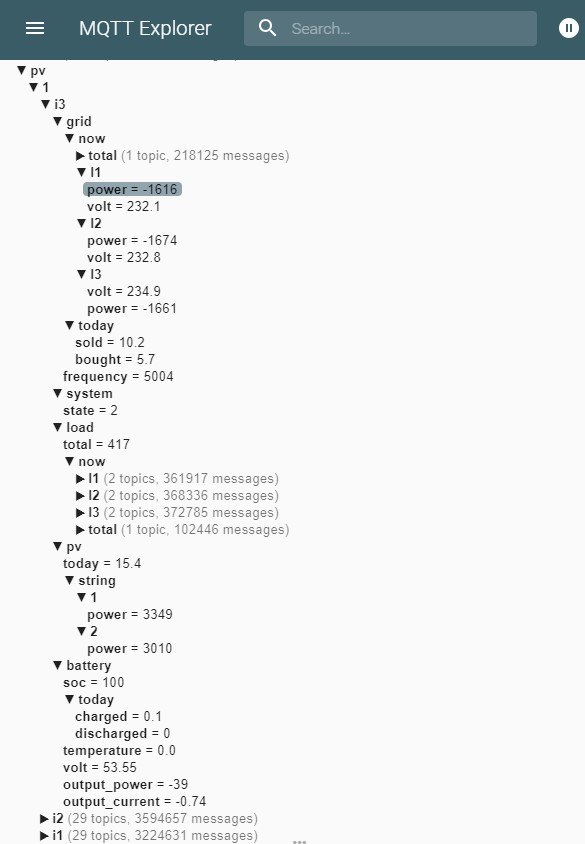

# Modbus to MQTT Gateway

This is a little helper I wrote to read registers from my Deye inverters and publish them as MQTT message. The configuration can be adjusted to read from any Modbus device via a Modbus TCP gateway (e.g. 
the Waveshare RS485 to RJ45) and supports reading from multiple sources at the same time.

## Prerequisites

Python >= 3.11

## Installing

1. Clone the repository

```bash
git clone https://github.com/mazocode/modbus2mqtt.git
```

2. Install required python packages

```bash
pip install -r requirements. txt
```

## Configuration

Create a configuration file (see examples/). Here is the basic syntax:

```yaml
mqtt:

  # Broker connection parameters

  host: "<mqtt-host>"    # <--- Replace with hostname/ip of your MQTT broker
  port: 1883
  tls: false
  username: "<username>" # <--- Replace with client username
  password: "<password>" # <--- Replace with client password
  topic_prefix: "deye"


schema:

  # You can publish data from different devices in parallel. Create
  # a schema for each device type with the registers to publish:

  - name: "deye-inverter"   # <--- Unique schema name
    readings:
    - name: "System State"  # <--- Friendly name for the data point
      topic: "system/state" # <--- gets added after <mqtt topic_prefix>/<source topic_prefix>
      register: 500         # <--- Holding register to read from
      length: 1             # <--- Length of the data in byte
      substract: 0          # <--- Value to substract before publishing
      signed: 1             # <--- True/false for signed/unsigned value
      divide: 1             # <--- Value to divide by before publishing

sources:

  # Your modbus sources to retrieve data from

  - name: "deye-inverter"  # <--- Name of your soruce
    host: "192.168.0.30"   # <--- Replace with the modbus gateway IP
    port: 502              # <--- Port your gateway is listening on
    unitid: 1              # <--- Modbus device id to read from
    schema: deye-inverter  # <--- Name of the schema to read
    topic_prefix: "abc"    # <--- Added to the <mqtt topic_prefix>
```


## Running

### Systemd

Adjust the service definition from systemd/ with the path you have clone the repository into and the path to your configuration file.

### Manual 

```bash
modbus2mqtt.py -c /path/to/config.yaml
```

## Examples

### Home Assistant with Deye SUN-xK-SG04LP3-EU inverters

See examples/Deye-SG04LP3-EU/

You can use home-assistant.yaml as a template for the MQTT integration. This example assumes messages are published to the following topic syntax: pv/plant-id/inverter-id:

```yaml
mqtt:
  topic_prefix: "pv"

schema:
  - name: "deye-sg04lp3-eu"
    readings:
    - name: "System State"
      topic: "system/state" # <--- becomes pv/i<1,2,3>/system/state
      # ...

sources:
  - name: "inverter1"
    schema: deye-sg04lp3-eu
    topic_prefix: "i1"    # <--- becomes pv/i1
  - name: "inverter2"
    schema: deye-sg04lp3-eu
    topic_prefix: "i2"    # <--- becomes pv/i2
  # ...
```

Result:


## Known Issues

- SSL with self signed certificates seems broken

## Contributing

I am always happy to receive contributions. If you plan to contribute back to this repo, please fork & open a PR.
